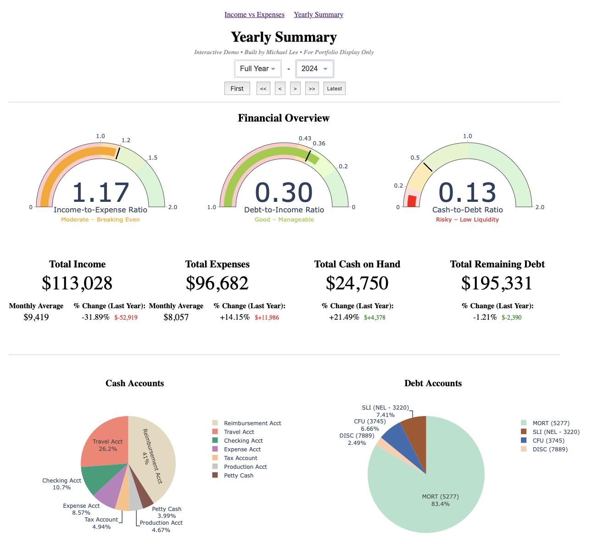
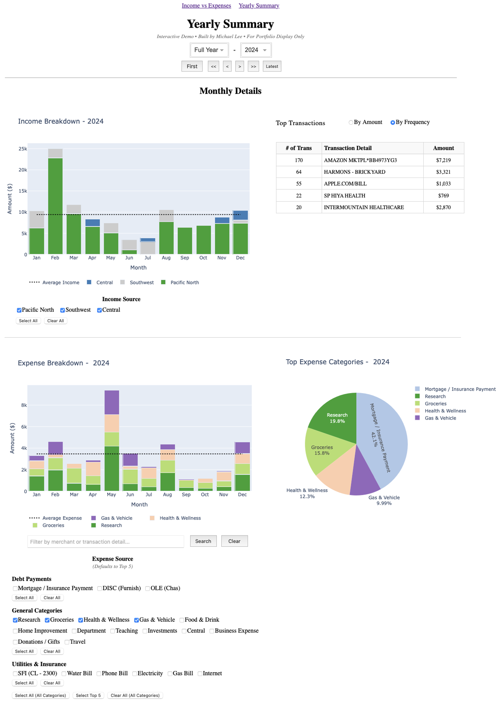
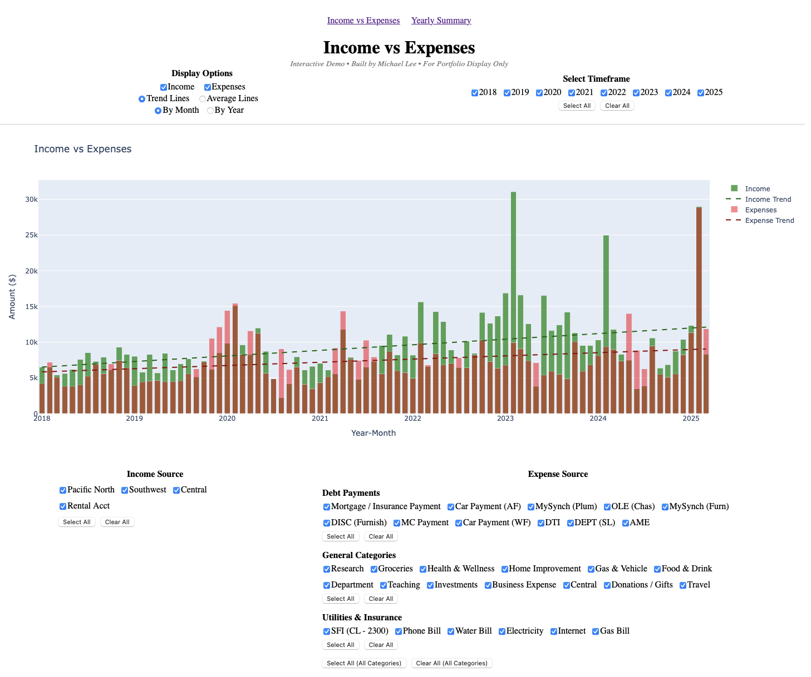

# PERSONAL FINANCE DASHBOARD
An interactive web app built with Dash and Plotly to visualize and analyze household finances over time. This tool tracks income, expenses, cash on hand, debt, and financial ratios with dynamic filtering by year and month. Designed for clarity, accountability, and long-term financial planning.

## OBJECTIVE

To create a web-based financial dashboard that allows for monthly and yearly analysis of income and spending, breakdowns by category, and the visualization of debt and cash flow trends—ultimately helping users manage their finances more effectively.

## KEY QUESTIONS ANSWERED

How does monthly income and spending change over time?
What are the top expenses and merchants each month?
How has our debt and cash-on-hand changed year over year?
What’s our income-to-expense ratio and cash-to-debt health?

## DATA CLEANING

Parsed and standardized 7+ years of CSV financial data from personal accounts, converting all dates and amounts to a consistent format.
Cleaned and categorized transactions into high-level financial groups: Income, Expenses, Debt Payments, Utilities, Insurance, and Cash on Hand.
Removed invalid rows and missing values using pandas, ensuring robust dataset integrity.

## ANALYSIS & ENGINEERING

Engineered dynamic monthly and yearly metrics: total income/expense, average monthly income/expense, YTD comparisons, and percent changes.
Built custom groupings for income types and expense categories, including debt/utility breakdowns.
Calculated ratios and trend lines for financial health metrics: income vs. expenses, cash-to-debt, and debt-to-income.

## DASHBOARD DEVELOPMENT

Developed a responsive multi-page dashboard using Dash (by Plotly):

-Yearly Summary View: Visual overview of income, spending, cash, and debt with interactive filters and gauges.

-Income vs. Expenses View: Stacked bar charts with drill-down capabilities for income and expense sources.

Added interactive components:

-Dropdowns, radio buttons, and buttons for selecting year/month.

-Top 5 categories, merchant search, and dynamic color-coded income and expense sources.

-Enabled stateful navigation via dcc.Store components for seamless cross-component syncing.

## KEY INSIGHTS

**Unexpected Positive Correlations:** Contrary to expectations, several variable expense categories showed strong positive correlations. For instance, higher spending on Food & Drink was positively correlated with Groceries, rather than substituting for it. Notably, Groceries appeared in 3 of the top 5 strongest correlations:

-Groceries & Health & Wellness: 0.69

-Groceries & Child: 0.68

-Groceries & Food & Drink: 0.63

-Food & Drink & Health & Wellness: 0.62

-Health & Wellness & Child: 0.50

**Minimal Negative Correlation:** Negative relationships among variable expenses were rare. The most notable was a weak inverse correlation between Shopping/Entertainment and Travel at -0.21.
Overspending Risk: Monthly expenses are outpacing income, indicating a potential overspending trend. The average monthly expense ($12,652) has slightly exceeded the average monthly income ($12,552) over the last four years.

**Debt Reduction:** Total debt has steadily decreased, while the cash-to-debt ratio has shown gradual year-over-year improvement—signaling better financial health.
Expense Concentration: A significant portion (50–60%) of total monthly expenses has consistently gone toward just three categories: mortgage payments, groceries, and child-related expenses.

**Declining Totals:** Both income and expense totals have been trending downward over the past four years, which may reflect lifestyle changes, income fluctuations, or intentional budget adjustments.

## DELIVERABLES

[Live Dashboard (PythonAnywhere)][(https://fianshadow.pythonanywhere.com)]

GitHub Repository: Source code, data processing scripts, and visualizations.

Screenshots: High-resolution visuals of each page of the dashboard.

## FUTURE IMPROVEMENTS

Add forecasting models to estimate end-of-year totals or simulate financial goals.

Incorporate budgeting tools with user-defined category limits.

Enable mobile responsiveness for use on smartphones and tablets.

Add support for multiple users or household members for shared tracking.

## SKILLS DEVELOPED

This project strengthened my skills in:

Data Wrangling: Parsing and cleaning multi-year financial data with pandas.

Interactive Dashboards: Building stateful UIs with Dash, dcc.Store, and dynamic callbacks.

Visualization: Using Plotly to create readable, insightful, and professional charts.

Financial Literacy: Translating raw transaction data into meaningful financial KPIs.

## NOTES ON DATA USAGE

This project uses sample financial data. No proprietary, sensitive, or personally identifiable information is included.

## SCREENSHOTS

